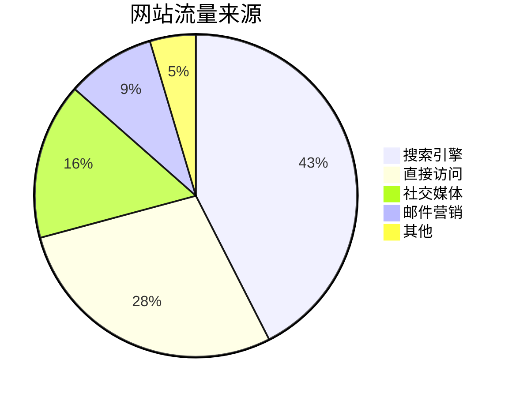
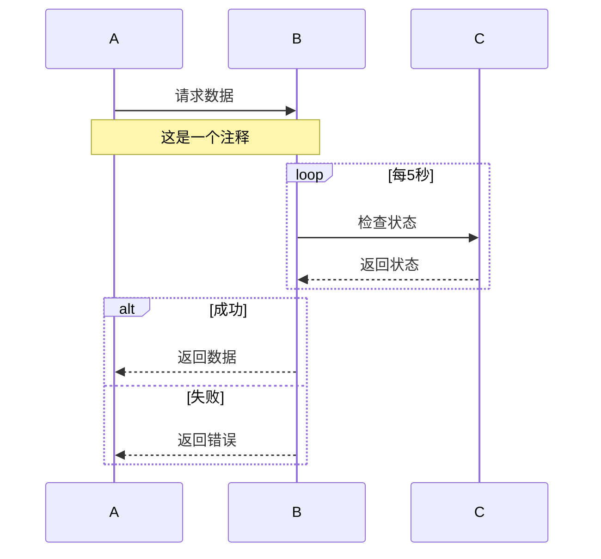

# h1 demo
<div align="center">
A source code based low-code builder.
</div>

English | [简体中文](/README.zh-CN.md)

## 📄 Documentation

You can view the detailed usage guide through the following links:

- Document site: <https://netease.github.io/tango-site/>
- Playground application: <https://tango-demo.musicfe.com/designer/>

## ✨ Features

- Tested in the production environment of NetEase Cloud Music, can be flexibly integrated into low-code platforms, local development tools, etc.
- Based on source code AST, with no private DSL and protocol
  Real-time code generation capability, supporting source code in and source code out
- Out-of-the-box front-end low-code designer, providing flexible and easy-to-use designer React components
- Developed using TypeScript, providing complete type definition files

## 下一步计划

- [x] 学习更多 Markdown 语法
- [ ] 尝试写一篇技术博客
- [ ] 用 Markdown 整理学习笔记

>真的猛士敢于直面惨淡的人生，敢于直视凛冽的鲜血。
>>周树人
>
>为了忘却的纪念
>```java
>public static void main(){//hello
>  System.out.println("hello word");    
>}

1. 胜多负少
1. 时尚大方
1. 委任为

- 胜多负少
- 时尚大方
- 委任为

- 胜多负少
  - 呃呃呃
  - 杀杀杀
    - 谔谔分
    - 发送 
- 时尚大方
- 委任为 [掘金](https://juejin.cn)


| 责任人 | 任务内容 | 截止时间 | 状态 |
|:-------:|----------|----------|------|
| 张三 | 整理详细需求文档 | 2024年1月18日 | ✅ **完成** |
| 李四 | 评估技术方案并提供开发计划 | 2024年1月20日 | ⭐⭐待完成 |
| 王五 | 提供完整设计稿 | 2024年1月22日 | 待完成 |





